# Modern-Ecommerce-Platforms
This project involves creating a modern e-commerce platform. It uses Wordpress forms and includes modeling business process systems from customer to delivery.

# Introduction
This project involves creating an e-commerce website for motorcycle shop The website will be built using the WordPress content management system and will include the 
WooCommerce plugin. The platform will allow customers to conveniently browse, select and order online.

# The main plugins that I use
- WooCommerce: is integrated seamlessly with WordPress, empowering our website with e-commerce capabilities, including product management, shopping cart 
functionality, and secure payment processing.
- PDF Invoices & Packing Slips for WooCommerce: is responsible for generating professional invoices and packing slips for customer orders, ensuring a smooth and professional shopping experience.
- PeproDev WooCommerce Receipt Uploader: Used for uploading receipts for any payment method in WooCommerce. The customer uploads the receipt (image/pdf) and the store manager manually approves/rejects it.

# Software
- Laragon: is utilized as our local development environment, providing a convenient platform for building and testing  E-Commerce
- WordPress: WordPress serves as the primary content management system (CMS) for our website, offering a flexible and user-friendly environment for managing web content.
- Visual Paradigm: Visual Paradigm is a versatile tool used in various industries for software development and system design. It can be particularly helpful for creating visual documentation, improving communication among team members, and ensuring that software projects are well-structured and well-documented.

# Website page

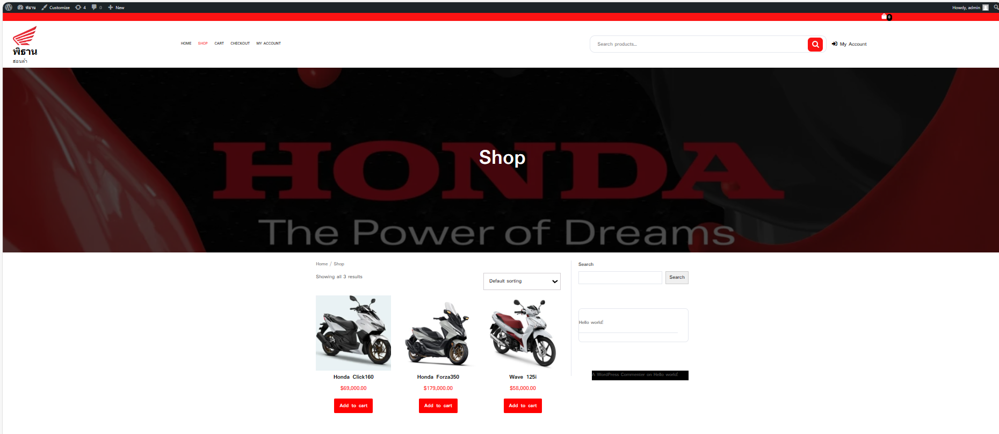

# Shopping cart
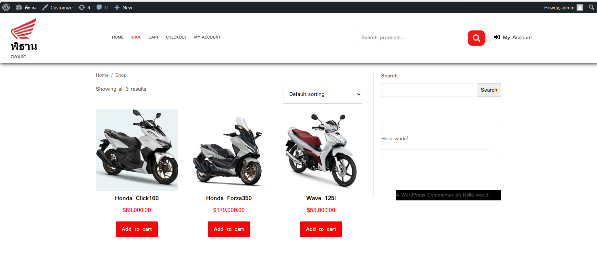
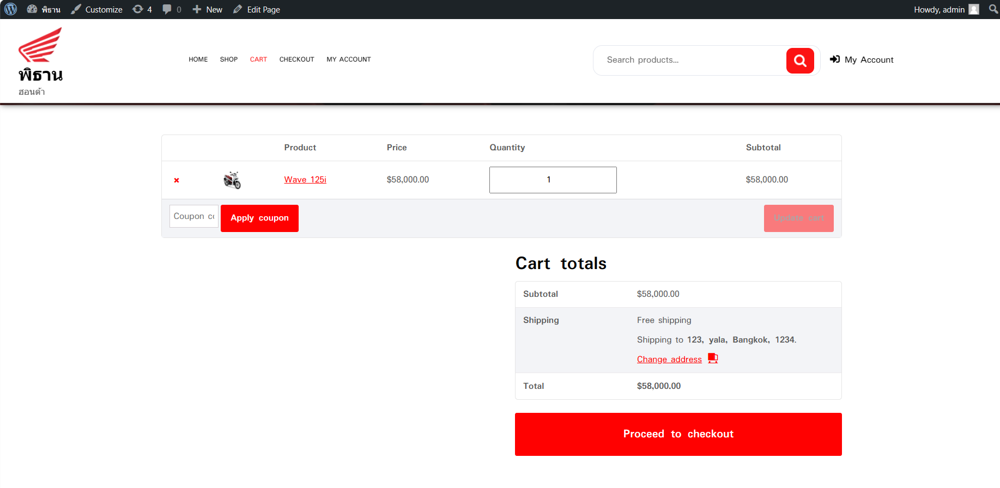

# Address information
Frame complete address information. then choose payment If you choose to pay by transfer, you must upload the slip as shown in the example below.

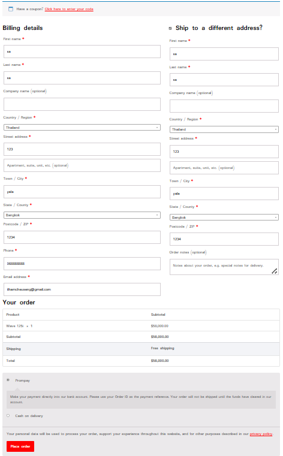

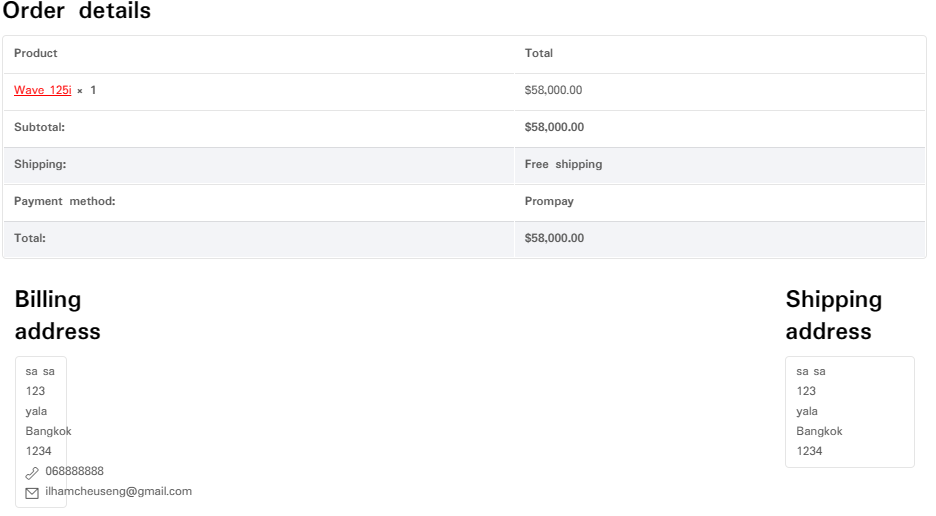

# Admin's order
Admin can check orders and receive orders, check slips and receive parcel numbers to send to customers.
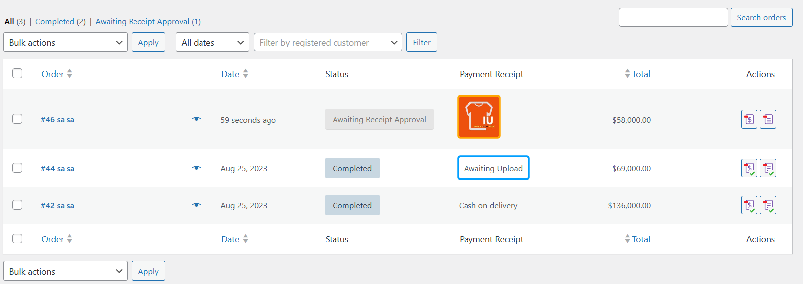

# Add product
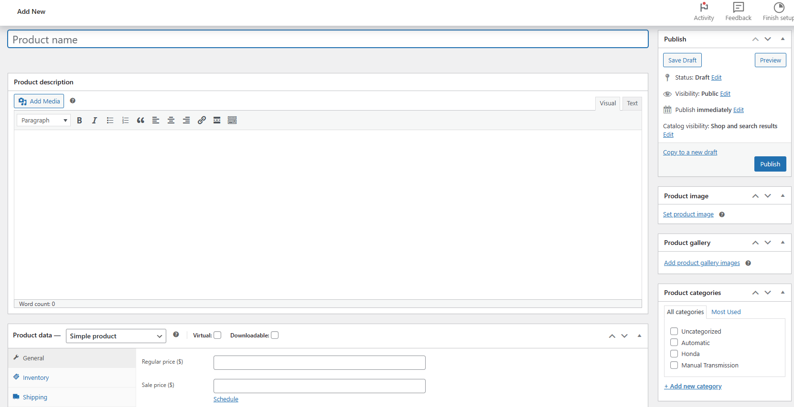

# All product
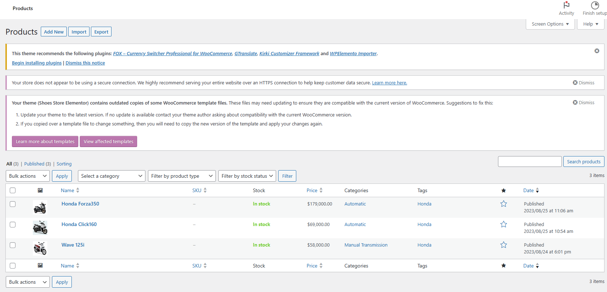

# Customer
The customer begins by selecting products to add to the cart. and can go back and select again If you have received the product you want It's the address information frame. Choose payment and press order.
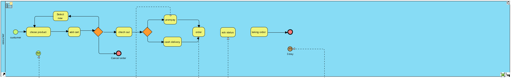

# Website
- Start form the first that is product information is that can make customer choes it.
- Second is taking customer order before the data go to backend.
- Third is taking slip from customer who choes transfer before the data go to backend.

# Admin 
-Correct gataway: when admin check correctness about payment. If correct, It will go to Check Stock process. If not correct, It will cancel the order.

-The next step will be preparing the customer's order. Pack the product well so that it is not damaged during the delivery.

-Next, the order will be sent to the shipping company.
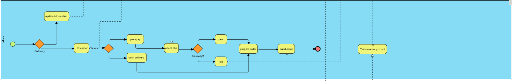

# Delivery
-A shipping company receives an order from an administrator to deliver goods to a customer.
-And will send the parcel number to the admin so that the admin can send the parcel number to the customer.
-Ext is to enter data into the system.
-And the product will be delivered to the customer within at least approximately 3 days (if payment is made on delivery, we can wait to pay the shipping cost)

# All Pools in BPMN
1. Customer
2. Admin
3. Website
4. Delivery

# BPMN Diagram
The BPMN diagram (Business Process Model and Notation) outlines the various processes and interactions within the e-commerce system, involving customers, admins, the website itself, and delivery processes. It helps visualize the workflow and interactions in the system.
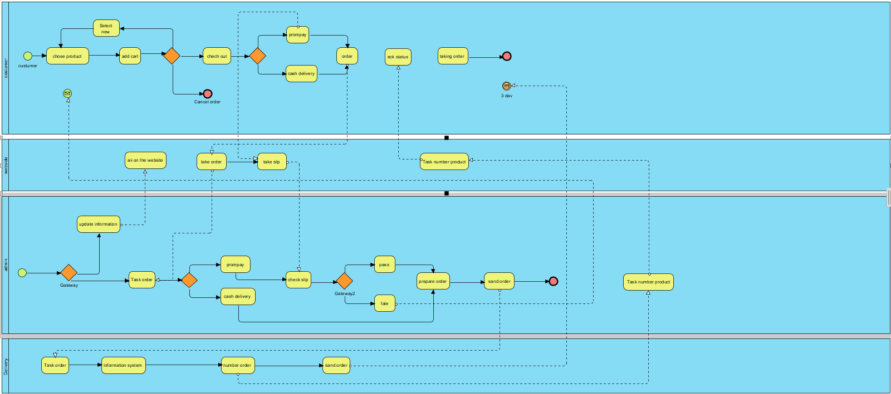

# Conclution
This ecommerce project involves creating a website for a motorcycle shop using WordPress as the content management system and WooCommerce as the main ecommerce plugin. The main objective of the website is to provide customers with a convenient platform to browse, select and order motorcycle products online.
